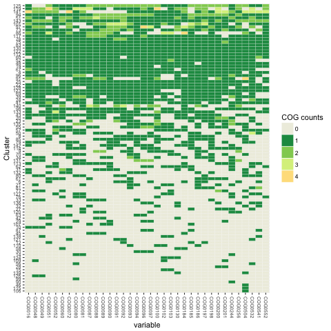
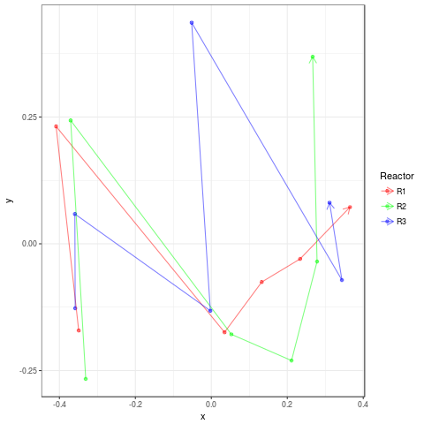
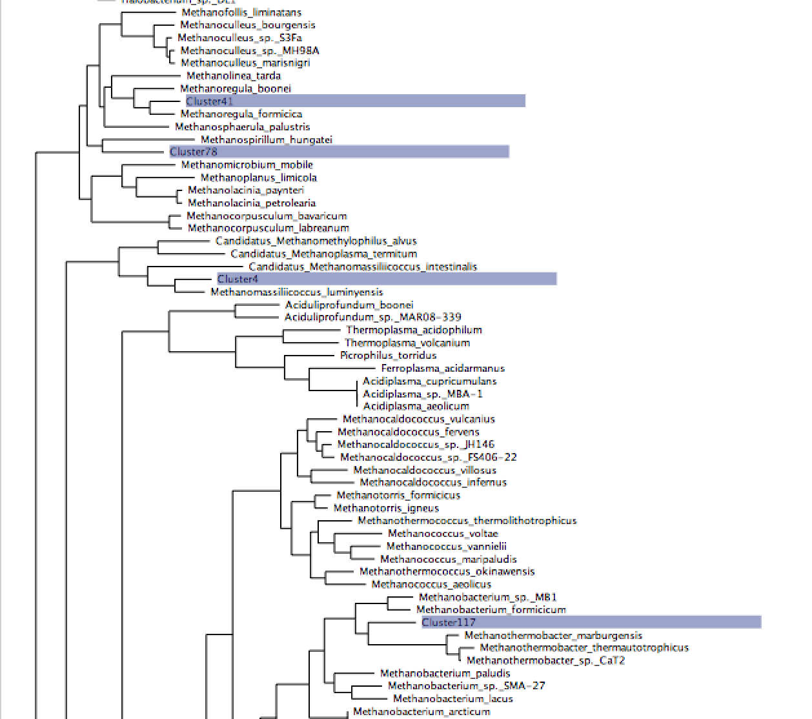

<a name="assembly"/>

# Assembly based metagenomics analysis

Assembly based metagenomics represents a complex analysis pathway:


1. [Coassembly](#coassembly)

2. [Read mapping](#readmapping)

3. [Contig binning](#binning)

4. [MAG annotation](#MAGs)

Login into your VM

We are now going to perform a basic assembly based metagenomics analysis of these same samples. 
This will involve a collection of different software programs:

1. megahit: A highly efficient metagenomics assembler currently our default for most studies

2. bwa: Necessary for mapping reads onto contigs

3. [samtools] (http://www.htslib.org/download/): Utilities for processing mapped files

4. CONCOCT: Our own contig binning algorithm

5. [prodigal] (https://github.com/hyattpd/prodigal/releases/): Used for calling genes on contigs

6. [gnu parallel] (http://www.gnu.org/software/parallel/): Used for parallelising rps-blast

7. [standalone blast] (http://www.ncbi.nlm.nih.gov/books/NBK52640/): Needs rps-blast

8. [COG RPS database] (ftp://ftp.ncbi.nih.gov/pub/mmdb/cdd/little_endian/): Cog databases

9. [GFF python parser] (https://github.com/chapmanb/bcbb/tree/master/gff)

<a name="coassembly"/>

## Assembly

We will now explore metagenomics assembly using the Ragna sample:

```
cd ~/Projects/Ragna/NotHuman
```

Lets have a look at the read lengths (just top 1000000 will do):
```
head -n 1000000 sk152_dentine_nothuman.fq > h1e6.fq
python ~/bin/LengthsQ.py -i h1e6.fq > h1e6.len
cat h1e6.len | cut -f2 | awk -f ~/bin/median.awk
```

and try megahit with appropriate kmer sizes:
```
megahit -r sk152_dentine_nothuman.fq --k-min 21 --k-max 71 --k-step 20 -o Assembly
```

Evaluate the assembly:

```
contig-stats.pl < Assembly/final.contigs.fa
```

Create assembly graph
```
cd Assembly
 megahit_toolkit contig2fastg 71 final.contigs.fa > final.contigs.fastg
```

This is a reasonable assembly but with relatively few reads actually assembled.

Quickly run centrifuge to see what organisms these derive from:

```
cd Assembly
centrifuge -x ~/Databases/Centrifuge/p_compressed -U final.contigs.fa -f --threads 8

```

No Salmonella!

Lets try spades:

```
spades.py -s sk152_dentine_nothuman.fq -o Assembly_S -k 21,41,61,71
```

```
cd ../Assembly_S
centrifuge -x ~/Databases/Centrifuge/p_compressed -U Contigs.fasta -f --threads 8
```

## Co-assembly

We will now return to the AD samples performing a co-assembly of these samples using 
megahit:

```
cd ~/Projets/AD
ls ReadsSub/*R1.fastq | tr "\n" "," | sed 's/,$//' > R1.csv
ls ReadsSub/*R2.fastq | tr "\n" "," | sed 's/,$//' > R2.csv
```

```
nohup megahit -1 $(<R1.csv) -2 $(<R2.csv) -t 8 -o Assembly > megahit.out&
```

```
contig-stats.pl < Assembly/final.contigs.fa
```

Should see results like:
```
sequence #: 469120	total length: 412545660	max length: 444864	N50: 1124	N90: 375
```

Discussion point what is N50?

If the assembly takes too long download the results instead:
```
mkdir Assembly
cd Assembly
wget https://septworkshop.s3.climb.ac.uk/final.contigs.fa
cd ..
```

<a name="readmapping"/>

## Read mapping

Then cut up contigs and place in new dir:

```bash


python $CONCOCT/scripts/cut_up_fasta.py -c 10000 -o 0 -m Assembly/final.contigs.fa > Assembly/final_contigs_c10K.fa
```

Having cut-up the contigs the next step is to map all the reads from each sample back onto them. First index the contigs with bwa:

```bash
cd Assembly
bwa index final_contigs_c10K.fa
cd ..
```

Then perform the actual mapping you may want to put this in a shell script:

```bash
mkdir Map

for file in ./ReadsSub/*R1.fastq
do 
   
   stub=${file%_R1.fastq}
   name=${stub##*/}
   
   echo $stub

   file2=${stub}_R2.fastq

   bwa mem -t 8 Assembly/final_contigs_c10K.fa $file $file2 > Map/${name}.sam
done
```

Discussion point how do mappers differ from aligners? Can we list examples of each?

How does (this)[https://en.wikipedia.org/wiki/Burrows%E2%80%93Wheeler_transform]  help DNA sequence analysis!

Discussion point nohup vs screen for long running jobs.


And calculate coverages:

```
python $DESMAN/scripts/Lengths.py -i Assembly/final_contigs_c10K.fa > Assembly/Lengths.txt

for file in Map/*.sam
do
    stub=${file%.sam}
    stub2=${stub#Map\/}
    echo $stub  
    samtools view -h -b -S $file > ${stub}.bam
    samtools view -b -F 4 ${stub}.bam > ${stub}.mapped.bam
    samtools sort -m 1000000000 ${stub}.mapped.bam -o ${stub}.mapped.sorted.bam
    bedtools genomecov -ibam ${stub}.mapped.sorted.bam -g Assembly/Lengths.txt > ${stub}_cov.txt
done
```
Collate coverages together:

```
for i in Map/*_cov.txt 
do 
   echo $i
   stub=${i%_cov.txt}
   stub=${stub#Map\/}
   echo $stub
   awk -F"\t" '{l[$1]=l[$1]+($2 *$3);r[$1]=$4} END {for (i in l){print i","(l[i]/r[i])}}' $i > Map/${stub}_cov.csv
done

$DESMAN/scripts/Collate.pl Map > Coverage.csv
```

<a name="binning"/>

## Contig binning

Now we can run CONCOCT:
```

    mkdir Concoct

    mv Coverage.csv Concoct

    cd Concoct

    tr "," "\t" < Coverage.csv > Coverage.tsv

    concoct --coverage_file Coverage.tsv --composition_file ../Assembly/final_contigs_c10K.fa -t 8 

```

Find genes using prodigal:
```
    cd ..
    
    mkdir Annotate

    cd Annotate/

    python $DESMAN/scripts/LengthFilter.py ../Assembly/final_contigs_c10K.fa -m 1000 >     final_contigs_gt1000_c10K.fa

    prodigal -i final_contigs_gt1000_c10K.fa -a final_contigs_gt1000_c10K.faa -d     final_contigs_gt1000_c10K.fna  -f gff -p meta -o final_contigs_gt1000_c10K.gff > p.out
```

Assign COGs change the -c flag which sets number of parallel processes appropriately:
```
    export COGSDB_DIR=~/Databases/rpsblast_cog_db
    $CONCOCT/scripts/RPSBLAST.sh -f final_contigs_gt1000_c10K.faa -p -c 8 -r 1
```

We are also going to refine the output using single-core gene frequencies. First we calculate scg frequencies on the CONCOCT clusters:
```
cd ../Concoct
python $CONCOCT/scripts/COG_table.py -b ../Annotate/final_contigs_gt1000_c10K.out  -m $CONCOCT/scgs/scg_cogs_min0.97_max1.03_unique_genera.txt -c clustering_gt1000.csv  --cdd_cog_file $CONCOCT/scgs/cdd_to_cog.tsv > clustering_gt1000_scg.tsv
```

Then we need to manipulate the output file formats slightly:
```
sed '1d' clustering_gt1000.csv > clustering_gt1000_R.csv
cut -f1,3- < clustering_gt1000_scg.tsv | tr "\t" "," > clustering_gt1000_scg.csv
$CONCOCT/scripts/Sort.pl < clustering_gt1000_scg.csv > clustering_gt1000_scg_sort.csv
```

Then we can run the refinement step of CONCOCT:
```
concoct_refine clustering_gt1000_R.csv original_data_gt1000.csv clustering_gt1000_scg_sort.csv > concoct_ref.out
```

This should result in 22 clusters with 75% single copy copy SCGs:
```
python $CONCOCT/scripts/COG_table.py -b ../Annotate/final_contigs_gt1000_c10K.out  -m $CONCOCT/scgs/scg_cogs_min0.97_max1.03_unique_genera.txt -c clustering_refine.csv  --cdd_cog_file $CONCOCT/scgs/cdd_to_cog.tsv > clustering_refine_scg.tsv
```

<a name="MAGs"/>

## Metagenome assembled genomes (MAGs)

First let us look at the cluster completeness:
```
$CONCOCT/scripts/COGPlot.R -s clustering_refine_scg.tsv -o clustering_refine_scg.pdf
```

 

Discussion point what is a MAG?

Then we calculate coverage of each cluster/MAG in each sample.
```
sed '1d' clustering_refine.csv > clustering_refineR.csv
python $DESMAN/scripts/ClusterMeanCov.py Coverage.csv clustering_refineR.csv ../Assembly/final_contigs_c10K.fa > clustering_refine_cov.csv
sed 's/Map\///g' clustering_refine_cov.csv > clustering_refine_covR.csv
```

Discussion point, how do we calculate cluster coverages?

```
cp ~/bin/ClusterCovNMDS.R .
Rscript ./ClusterCovNMDS.R
```

How well does this correlate with time/replicates.

 


## Annotate MAGs

First lets label COGs on genes:
```
cd ~/Projects/AD/Annotate
python $DESMAN/scripts/ExtractCogs.py -b final_contigs_gt1000_c10K.out --cdd_cog_file $CONCOCT/scgs/cdd_to_cog.tsv -g final_contigs_gt1000_c10K.gff > final_contigs_gt1000_c10K.cogs
```

Discussion point what is a COG?

Then genes:
```
python $DESMAN/scripts/ExtractGenes.py -g final_contigs_gt1000_c10K.gff > final_contigs_gt1000_c10K.genes
cd ..
```

Return to the analysis directory and create a new directory to bin the contigs into:

```
mkdir Split
cd Split
$DESMAN/scripts/SplitClusters.pl ../Annotate/final_contigs_gt1000_c10K.fa ../Concoct/clustering_refine.csv
SplitCOGs.pl ../Annotate/final_contigs_gt1000_c10K.cogs ../Concoct/clustering_refine.csv
SplitGenes.pl ../Annotate/final_contigs_gt1000_c10K.genes ../Concoct/clustering_refine.csv
SplitFaa.pl ../Annotate/final_contigs_gt1000_c10K.faa ../Concoct/clustering_refine.csv
cd ..
```

Kegg ortholog assignment on genes:
```
python ~/bin/CompleteClusters.py ../Concoct/clustering_refine_scg.tsv > Cluster75.txt
```

```
    while read line
    do 
    file=${line}/${line}.faa
    stub=${file%.faa}
    base=${stub##*/}
    echo $base

    diamond blastp -d $KEGG_DB/genes/fasta/genes.dmnd -q $file -p 8 -o ${stub}.m8
    done < Cluster75.txt
```

Run this instead:

```
while read line
do 
    echo $file
  
    file=${line}/${line}.m8
  
    cp ~/Projects_run/AD/Split/$file $file
  
done < Cluster75.txt
```


Discussion point why blastp rather than blastx?

The above maps onto Kegg genes these are then mapped to kegg orthologs by the Perl script:
```
more ~/bin/Assign_KO.pl
```

Run as follows:
```
COUNT=0
for file in Cluster*/*m8
do
	dir=${file%.m8}
	echo $file
	echo $dir
     Assign_KO.pl < $file > ${dir}.hits&
    let COUNT=COUNT+1

    if [ $COUNT -eq 8 ]; then
        wait;
        COUNT=0
    fi
done
```

Discussion point, trivial parallelisation using bash.


We then can create a table of Kegg orthologs across all clusters.
```
~/repos/MAGAnalysis/scripts/CollateHits.pl > CollateHits75.csv
```

Discussion point any methanogens?

## Annotate to Kegg modules

Now we find which Kegg modules are present in each cluster by querying their [module reconstruct tool] (http://www.genome.jp/kegg/tool/map_module.html)

```
python ~/repos/MAGAnalysis/scripts/KO2MODULEclusters2.py -i CollateHits75.csv -o Collate_modules.csv 
```

Discussion point, when is a module present? What about methanogenesis modules?

## Taxonomic classification of contigs

There are many ways to taxonomically classify assembled sequence. We suggest a gene based approach. The first step is to call genes on all contigs that are greater than 1,000 bp. Shorter sequences are unlikely to contain complete 
coding sequences. 


Set the environment variable NR_DMD to point to the location of your formatted NR database:
```
export NR_DMD=$HOME/Databases/NR/nr.dmnd
```

Then we begin by copying across the ORFs called on all contigs greater than 1000bp in length.
```
cd ~/Projects/AD/
mkdir AssignTaxa
cd AssignTaxa
cp ../Annotate/final_contigs_gt1000_c10K.faa .
```

Then we use diamond to match these against the NCBI NR.

```
diamond blastp -p 8 -d $NR_DMD -q final_contigs_gt1000_c10K.faa -o final_contigs_gt1000_c10K_nr.m8 > d.out
```

Discussion point, what is the difference between NCBI NR and NT?

Discussion point, what is the difference between diamond blastp and blastx?

To classify the contigs we need two files a gid to taxid mapping file and a mapping of taxaid to full lineage:

1. gi_taxid_prot.dmp

2. all_taxa_lineage_notnone.tsv

These can also be downloaded from the Dropbox:
``` 
wget https://www.dropbox.com/s/x4s50f813ok4tqt/gi_taxid_prot.dmp.gz
wget https://www.dropbox.com/s/honc1j5g7wli3zv/all_taxa_lineage_notnone.tsv.gz
```

The path to these files are default in the ClassifyContigNR.py script as the variables:
```
DEF_DMP_FILE = "/home/ubuntu/Databases/NR/gi_taxid_prot.dmp"

DEF_LINE_FILE = "/home/ubuntu/Databases/NR/all_taxa_lineage_notnone.tsv"
```

We calculate the gene length in amino acids before running this.
Then we can assign the contigs and genes called on them:
```
python $DESMAN/scripts/Lengths.py -i final_contigs_gt1000_c10K.faa > final_contigs_gt1000_c10K.len
python $DESMAN/scripts/ClassifyContigNR.py final_contigs_gt1000_c10K_nr.m8 final_contigs_gt1000_c10K.len -o final_contigs_gt1000_c10K_nr -l /home/ubuntu/Databases/NR/all_taxa_lineage_notnone.tsv -g /home/ubuntu/Databases/NR/gi_taxid_prot.dmp
```

Then we extract species out:
```
$DESMAN/scripts/Filter.pl 8 < final_contigs_gt1000_c10K_nr_contigs.csv | grep -v "_6" | grep -v "None" > final_contigs_gt1000_c10K_nr_species.csv
```

These can then be used for a cluster confusion plot:
```
$CONCOCT/scripts/Validate.pl --cfile=../Concoct/clustering_refine.csv --sfile=final_contigs_gt1000_c10K_nr_species.csv --ffile=../Assembly/final_contigs_c10K.fa --ofile=Taxa_Conf.csv
```
Now the results will be somewhat different...
```
N       M       TL      S       K       Rec.    Prec.   NMI     Rand    AdjRand
83338   1132    5.9010e+06      26      145     0.839512        0.982511        0.684733        0.883928        0.769207
```

Then plot:
```
$CONCOCT/scripts/ConfPlot.R -c Taxa_Conf.csv -o Taxa_Conf.pdf
```


## Construct a phylogenetic tree

Assume we are starting from the 'Split' directory in which we have seperated out the cluster fasta files and we have done the COG assignments for each cluster. Then the first step is to extract each of the 36 conserved core COGs individually. There is an example bash script GetSCG.sh for doing this in phyloscripts but it will need modifying:

```
cd ~/Projects/AD/Split
cp ~/repos/MAGAnalysis/cogs.txt .
mkdir SCGs

while read line
do
    cog=$line
    echo $cog
     ~/repos/MAGAnalysis/phyloscripts/SelectCogsSCG.pl ../Concoct/clustering_refine_scg.tsv ../Annotate/final_contigs_gt1000_c10K.fna $cog > SCGs/$cog.ffn
done < cogs.txt
``` 

Run this after making a directory SCGs and it will create one file for each SCG with the corresponding nucleotide sequences from each cluster but only for this with completeness (> 0.75) hard coded in the perl script somewhere you should check that :)

Then we align each of these cog files against my prepared database containing 1 genome from each bacterial genera and archael species:
```
mkdir AlignAll

while read line
do
    cog=$line
    echo $cog
    cat ~/Databases/NCBI/Cogs/All_$cog.ffn SCGs/${cog}.ffn > AlignAll/${cog}_all.ffn
    mafft --thread 64 AlignAll/${cog}_all.ffn > AlignAll/${cog}_all.gffn
done < cogs.txt
```

Then trim alignments:

```
for file in  AlignAll/*gffn
do
    echo $stub
    stub=${file%.gffn}
    trimal -in $file -out ${stub}_al.gfa -gt 0.9 -cons 60
done
```

The next script requires the IDs of any cluster or taxa that may appear in fasta files, therefore:

```
cat AlignAll/*gffn | grep ">" | sed 's/_COG.*//' | sort | uniq | sed 's/>//g' > Names.txt
```

Which we run as follows:

```
~/repos/MAGAnalysis/phyloscripts/CombineGenes.pl Names.txt AlignAll/COG0*_al.gfa > AlignAll.gfa
```

Then we may want to map taxaids to species names before building tree:

```
~/repos/MAGAnalysis/phyloscripts/MapTI.pl /home/ubuntu/repos/MAGAnalysis/data/TaxaSpeciesR.txt < AlignAll.gfa > AlignAllR.gfa
```

Finally we get to build our tree:

```
fasttreeMP -nt -gtr < AlignAllR.gfa 2> SelectR.out > AlignAllR.tree
```

Visualise this locally with FigTree or on the web with ITOL




### Annotating to other functional databases

Other databases are HMM based.

Discussion point what is a hidden Markov model classifier?

The CAZyme database is available standalone from [dbCAN](http://csbl.bmb.uga.edu/dbCAN/)

```
hmmscan --cpu 8 --domtblout final_contigs_gt1000_c10K_faa_dbcan.dm ~/Databases/dbCAN/dbCAN-fam-HMMs.txt.v5 final_contigs_gt1000_c10K.faa  
```

You will need this parser script:
```
more ~/bin/hmmscan-parser.sh
```

```
hmmscan-parser.sh < final_contigs_gt1000_c10K_faa_dbcan.dm > final_contigs_gt1000_c10K_dbcan.tsv
```

Then we get consensus:
```
~/repos/WorkshopSept2017/scripts/ConsensusDB.pl < final_contigs_gt1000_c10K_dbcan.tsv > final_contigs_gt1000_c10K_dbcan_con.hits
```

You will need to update your repo to get parser. Can then split across clusters.

```
cd ../Split
SplitDB.pl ../Annotate/final_contigs_gt1000_c10K_dbcan_con.hits ../Concoct/clustering_refine.csv
```

The above script can be created from SplitGenes.pl with one edit.
Can also run for each cluster separately.

About what E-value and Coverage cutoff thresholds you should use (in order to further parse yourfile.out.dm.ps file), we have done some evaluation analyses using arabidopsis, rice, Aspergillus nidulans FGSC A4, Saccharomyces cerevisiae S288c and Escherichia coli K-12 MG1655, Clostridium thermocellum ATCC 27405 and Anaerocellum thermophilum DSM 6725. Our suggestion is that for plants, use E-value < 1e-23 and coverage > 0.2; for bacteria, use E-value < 1e-18 and coverage > 0.35; and for fungi, use E-value < 1e-17 and coverage > 0.45.

We have also performed evaluation for the five CAZyme classes separately, which suggests that the best threshold varies for different CAZyme classes (please see http://www.ncbi.nlm.nih.gov/pmc/articles/PMC4132414/ for details). Basically to annotate GH proteins, one should use a very relax coverage cutoff or the sensitivity will be low (Supplementary Tables S4 and S9); (ii) to annotate CE families a very stringent E-value cutoff and coverage cutoff should be used; otherwise the precision will be very low due to a very high false positive rate (Supplementary Tables S5 and S10)