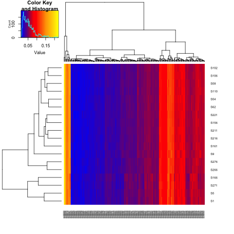

# Taxonomic and Functional Profiling


## Taxonomic profiling

Login to server:

```
ssh -X ubuntu@137.205.69.49
```

We will start by profiling the AD reads with Kraken. We will use forward reads only:

```
mkdir Kraken
for file in ReadsSub/*R1*fastq
do
    base=${file##*/}
    stub=${base%_R1.fastq}
    echo $stub
    kraken --db ~/Databases/minikraken_20141208/ --threads 8 --preload --output Kraken/${stub}.kraken $file
done
```

We match against the 'minikraken' database which corresponds to RefSeq 2014.
Would we expect the profile to differ between R1 and R2?

Look at percentage of reads classified. Anaerobic digesters are under studied communities!

Discussion point what can we do about under representation in Database?

The output is just a text file:

```
head Kraken/S102_Sub.kraken
```

And we can generate a report:

```
kraken-report --db ~/Databases/minikraken_20141208/  Kraken/S102_Sub.kraken >  Kraken/S102_Sub.kraken.report
```

Some people prefer a different format:
```
kraken-mpa-report --db ~/Databases/minikraken_20141208/ Kraken/S102_Sub.kraken > Kraken/S102_Sub.kraken.mpa.report
```

We can get a report of the predicted genera:
```
cat  Kraken/S102_Sub.kraken.report | awk '$4=="G"'
```

What is awk?

Now lets get reports on all samples:
```
for file in Kraken/*.kraken
do
    stub=${file%.kraken}
    echo $stub
    kraken-report --db ~/Databases/minikraken_20141208/ $file >  ${stub}.kraken.report
done
```

Having done this we want to get one table of annotations at the genera level for community comparisons:

```
for file in Kraken/*.kraken.report
do
    stub=${file%.kraken.report}
    cat  $file | awk '$4=="G"' > $stub.genera
done
```

And then run associated script:
```
CollateK.pl Kraken > GeneraKraken.csv
```
There is a clear shift in genera level structure over time but no association with replicate.


We can generate this plot either locally or on the server by:

```
cp ~/Data/AD/Meta.csv .
Rscript ~/repos/WorkshopSept2017/RAnalysis/GeneraKNMDS.R 
```

Discussion points:
1. Non-metric multidimensional scaling
2. Multivariate permutational ANOVA

<a name="functionalprofiling"/>

## How to build a Kraken database

Mick Watson has written some Perl scripts that will download and build 
kraken databases for bacteria, archaea, fungi, protozoans and viruses at various stages of completion.

[Kraken DB install scripts](https://github.com/mw55309/Kraken_db_install_scripts)

Note: these will take a while so be careful.

To build a custom database, first we need the NCBI taxonomy:

```
DB_NAME="kraken_db"
kraken-build --download-taxonomy --db $DB_NAME
```

Then let’s imagine we have a directory full of FNA files 
(the download_*.pl scripts by Mick will create well formatted .fna files; 
otherwise you can download directly from the NCBI)

```
for f in `ls mydir/*.fna`; do
  kraken-build --add-to-library $f --db $DB_NAME
done
```

Then finally

```
kraken-build --build --db $DB_NAME
```

This will create a large kmer index file in a directory with the same name as your kraken database. 
Roughly speaking, the size of this file represents the amount of RAM you will need to run Kraken

## Running Metaphlan2 on the human gut

```
cd ~/Projects
mkdir ~/Projects/Gut
ln -s ~/Data/Gut/Reads Reads
```

There are too many reads to work with here so first thing we will do is subsample them to 100,000

```
mkdir ReadsSub
for file in Reads/*fasta
do
    base=${file##*/}
    stub=${base%.fasta}
    echo $stub
    seqtk sample -s100 $file 100000 > ReadsSub/${stub}_Sub.fasta
done
```

Much easier to work with
```
grep -c ">" ReadsSub/*fasta
```

And we will cat these together for convenience:
```
for file in ReadsSub/*_R1_Sub.fasta
do
    base=${file##*/}
    stub=${base%_R1_Sub.fasta}
    cat $file ReadsSub/${stub}_R2_Sub.fasta > ReadsSub/${stub}_R12.fasta
done
```

Note these files are not true interleaved fasta.

```
mkdir MetaphlanResults
for file in ReadsSub/*_R12.fasta
do
    base=${file##*/}
    stub=${base%_R12.fasta}

    echo $stub
    
    python ~/Installation/metaphlan2/metaphlan2.py $file --input_type fasta --nproc 8 > MetaphlanResults/${stub}_pm.txt
done
```


Then when we are done we merge these tables:
```
python ~/Installation/metaphlan2/merge_metaphlan_tables.py MetaphlanResults/*_pm.txt > MetaphlanMerged/merged_abundance_table.txt
```

and generate a heatmap:
```
python ~/Installation/metaphlan2/utils/metaphlan_hclust_heatmap.py -c bbcry --top 25 --minv 0.1 -s log --in MetaphlanMerged/merged_abundance_table.txt --out MetaphlanMerged/abundance_heatmap.png
```


<a name="functionalprofiling"/>

## Centrifuge profiling of Ragna reads

Run centrifuge against Prokaryotes as follows:

```
centrifuge -x ~/Databases/Centrifuge/p_compressed -U sk152_dentine_nothuman.fq -q --threads 8 > sk152_dentine_nothuman_cent.tsv
```

Over 50% of the reads are classified to Salmonella enterica:
```
Salmonella enterica	28901	species	6689149	58538	50642	0.557764
```


## Functional gene profiling of AD reads

To perform functional gene profiling we will use Diamond to map against the KEGG database. 
First we will set an environmental variable to point to our copy of the Kegg:
```
export KEGG_DB=~/Databases/keggs_database/KeggUpdate/
```
```
cd ~/Projects/AD
mkdir KeggD
for file in ReadsSub/*R1.fastq
do 
   
   stub=${file%_R1.fastq}
   stub=${stub#ReadsSub\/}
   echo $stub
   if [ ! -f KeggD/${stub}.m8 ]; then
    echo "KeggD/${stub}.m8"
    diamond blastx -d $KEGG_DB/genes/fasta/genes.dmnd -q $file -p 8 -o KeggD/${stub}.m8
   fi
done
```

Having mapped reads to the KEGG genes we can collate these into ortholog coverages:
```
for file in KeggD/*.m8
do
    stub=${file%.m8}

    echo $stub
    
    python ~/bin/CalcKOCov.py $file $KEGG_DB/ko_genes_length.csv $KEGG_DB/genes/ko/ko_genes.list > ${stub}_ko_cov.csv

done
```

Note this script uses a hard coded read length of 150 nt or 50 aa.

Discussion points:

1. What is coverage?

2. What pipelines exist for doing this, HumanN? Could we use kmers for functional profiling?

3. What is the [KEGG](http://www.genome.jp/kegg/pathway.html)

We collate these into a sample table:
```
mkdir FuncResults
CollateKO.pl KeggD > FuncResults/ko_cov.csv
```

and also KEGG modules:
```
for file in KeggD/*ko_cov.csv
do
    stub=${file%_ko_cov.csv}

    echo $stub
    python ~/bin/MapKO.py $KEGG_DB/genes/ko/ko_module.list $file > ${stub}_mod_cov.csv 
done
```

Collate those across samples:
```
CollateMod.pl KeggD > CollateMod.csv
mv CollateMod.csv FuncResults
```

What about module names? My former PDRA (Umer Ijaz) has a nice one liner for this:

```
cd FuncResults
awk -F"," 'NR>1{print $1}' CollateMod.csv | xargs -I {} curl -s http://rest.kegg.jp/find/module/{} > ModNames.txt
cd ..
```

We can view modules as multivariate data just like the genera relative frequencies. Is there a stronger or weaker relationship between time and module abundance than there was 
for the genera abundances?

